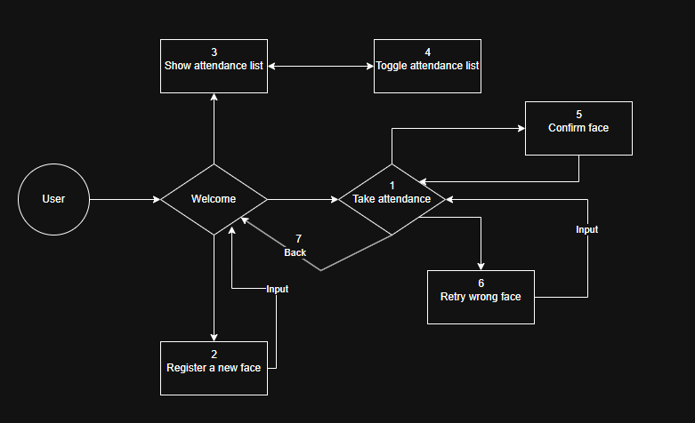

### Welcome to my project

# 📸 Attendance Checking with Facial Recognition - MLOps Project

## 📚 Contents

- [🔰 Introduction](#-introduction)
- [🏗️ Architecture](#-architecture)
- [📁 Folder Structure](#-folder-structure)
- [⚙️ Installation](#-installation)
  - [1. Clone the repository](#1-clone-the-repository)
  - [2. Create and activate virtual environment](#2-create-and-activate-virtual-environment)
  - [3. Install dependencies](#3-install-dependencies)
  - [4. Configure Weights & Biases](#4-configure-weights--biases)
- [🖼️ Instructions](#-instructions)
- [⚙️ CI/CD Pipeline](#-cicd-pipeline)
- [🧭 Next Steps](#-next-steps)

## 🔰 Introduction

This project aims to develop a facial recognition-based attendance system to streamline student tracking in classrooms. By leveraging Machine Learning and MLOps practices, the system automates attendance, improving accuracy and operational efficiency. It provides a scalable, maintainable solution for educational institutions looking to replace traditional manual methods.

Manual attendance tracking in classrooms is time-consuming, error-prone, and susceptible to fraud. These issues are amplified in large-scale classes, where administrative tasks can hinder instructional time and classroom efficiency. Additionally, the lack of automation makes it difficult to scale or integrate with modern digital education infrastructures.

To address these challenges, the project proposes an end-to-end facial recognition attendance system. The solution integrates real-time video input with trained face recognition models for automated student identification and attendance logging. The system incorporates an MLOps pipeline, ensuring automation in data versioning, model training, continuous integration/deployment (CI/CD), monitoring, and retraining.

The main objective of this project is to automate the attendance process, saving time for both instructors and students. It aims to:
- Minimize errors and prevent cheating by using facial recognition instead of roll calls or sign-in sheets.
- Update and store attendance data in real-time, enabling easy tracking, reporting, and management.
- Enhance the professionalism and modernization of classroom management in educational institutions.

---

## 🏗️ Architecture

---
### User Flow 



---

# Attendance Checking by Facial Recognition

This project develops a facial recognition-based attendance system, integrating face detection, attendance management, and model training.

## 📁 Folder Structure

```bash
Attendence_Checking_by_Facial_Recognition/  # Main project folder
├── .github/
│   └── workflows/
│       └── main.yml                      # GitHub Actions CI/CD workflow
├── UI/                                   # PyQt5-based user interface
│   ├── icon/                             # Icons used in the UI
│   ├── src/                              # Additional UI resources or modules
│   ├── api_client.py                     # Handles API communication from UI
│   ├── attendance_manager.py             # Logic to manage attendance states
│   ├── dialogs.py                        # Dialog windows (pop-ups, prompts)
│   ├── face_detector.py                  # Face detection module
│   ├── main_window.py                    # Main window logic
│   ├── test.ipynb                        # UI testing notebook
│   └── ui.py                             # UI layout definitions
├── api/
│   └── main.py                           # Backend API for face recognition
├── artifacts/                            # Saved models or intermediary data
├── data/                                 # Raw and processed datasets
├── log.csv                               # Log file for attendance
├── main.ipynb                            # Main demo or workflow notebook
├── model_export                          # Exported face recognition models
├── README.md                             # Project documentation
├── requirements.txt                      # Python dependencies
├── retrain/                              # Scripts to retrain the model
│   ├── 2_Data_segregation.py             # Splits data for training/testing
│   ├── 3_Training_model.py               # Model training script
│   └── 4_Testing.py                      # Model evaluation script
├── src/                                  # Core ML utilities
│   ├── __pycache__/                      # Compiled Python cache
│   ├── _init_.py                         # Package initialization
│   ├── feature_engineering.py            # Feature extraction logic
│   ├── preprocessing.py                  # Data cleaning & preprocessing
│   └── utils.py                          # Utility/helper functions
├── test.ipynb                            # General testing notebook
├── testing.ipynb                         # Additional model or feature tests
├── wandb/                                # Weights & Biases experiment logs
├── website_dashboard/                    # Web dashboard for admins
│   ├── api/                              # Backend APIs for dashboard
│   ├── artifacts/                        # Saved results for visualization
│   ├── data/                             # Dataset used in dashboard
│   ├── static/                           # Static files (CSS, JS, images)
│   ├── templates/                        # HTML templates (Jinja2)
│   ├── wandb/                            # W&B logs for dashboard
│   ├── .gitignore                        # Git ignore rules
│   ├── app.py                            # Flask app entry point
│   ├── config.py                         # Configuration settings
│   └── requirements.txt                  # Dashboard-specific dependencies
├── 1. ETL_process.ipynb                  # Extract, Transform, Load process
├── 2. Data_segregation.ipynb             # Notebook for dataset splitting
├── 3. Training_model.ipynb               # Notebook for training ML model
└── 4. Testing.ipynb                      # Notebook for testing model accuracy

```
---

## ⚙️ Installation

### 1. Clone the repository

```bash
git clone https://github.com/qviuqh/Attendence_Checking_by_Facial_Recognition
cd yourproject
```

### 2. Create and activate virtual environment

```bash
python -m venv .env
# On macOS/Linux:
source .env/bin/activate
# On Windows:
.env\Scripts\activate
```

### 3. Install dependencies

```bash
pip install -r requirements.txt
```

### 4. Configure Weights & Biases

Create a `.env` file and add your W&B API key:

```bash
WANDB_API_KEY=your_wandb_key_here
```
## To use Dashboard App 

### 1. Go to Website Dashboard Folder 

```bash
cd path/to/Attendence_Checking_by_Facial_Recognition/website_dashboard 
```

### 2. Install requirements 
```bash
pip install -r requirements.txt
```

### 3. Configure wandb

Create a `.env` file and add your W&B API key:

```bash
echo "WANDB_API_KEY=your_actual_key_here" > .env
```

### 4. Run Application 
```bash
python app.py 
```

---

## 🖼️ Instructions

### 🧑‍💻 How to Use the Application

This section explains how the app work and interactions with the desktop attendance app:

1. **Startup Interface**:
   - When the application launches, it shows **3 buttons**:
     - `Take Attendance`
     - `Register New Face`
     - `Show Attendance List`

2. **Show Attendance List**:
   - When clicked, it opens a list displaying:
     - Student **Name**
     - **ID**
     - **Present status**
   - This button toggles to **Close Attendance List** when opened.

3. **Register New Face**:
   - Prompts the user to **input a video** of a new student following a required format.
   - The system will extract facial features and associate them with a student ID.

4. **Take Attendance**:
   - Starts the webcam for real-time recognition.
   - Three new buttons appear:
     - ✅ `Confirm` – confirms detected faces and updates the attendance list.
     - 🔁 `Retry Wrong Face` – allows students to input their **Student ID** if misclassified, then re-checks.
     - 🔙 `Back` – stops the camera and returns to the initial 3-button interface. The extra buttons (`Confirm`, `Retry`, `Back`) disappear.

5. **Flow Logic**:
   - After each confirmation, the `Take Attendance` process continues.
   - Exiting via `Back` will cleanly shut the camera and return to the main screen.

---

### 📷 Sample Screenshots


## ⚙️ CI/CD Pipeline
This project uses **GitHub Actions** to: automatically retrain a machine learning model whenever new video data is uploaded. The process includes preprocessing video data, generating embeddings, and uploading both embeddings and the updated model to Weights & Biases (WandB).

Key Features:
- Fully automated retraining via GitHub Actions triggered by a repository_dispatch event from a backend system.
- Sequential execution of data segregation, training, and testing scripts.
- Secure WandB integration using GitHub Secrets.
- Resulting model artifacts (e.g., .pkl files) are logged and stored in WandB.

_Workflow file:_
```bash
.github/workflows/main.yml
```

---

## 🧭 Next Steps

### Short-Term Orientation

#### 1. Integration with Learning Management Systems (LMS)
In the initial phase, the project will focus on integrating with popular LMS platforms such as Moodle or Google Classroom, enabling automatic synchronization of attendance data with the course management systems.

#### 2. Improving Facial Recognition Accuracy
The system will first be optimized to operate effectively under common classroom lighting conditions. The goal is to ensure accurate facial recognition in typical classroom scenarios.

#### 3. Supporting Attendance for a Single Class
Basic functionalities will be developed to support attendance for a single class. This includes facial recognition-based check-in, attendance list display, and storing attendance status.

#### 4. Developing a Mobile Interface
A mobile-friendly version of the application will be created so that students can mark their attendance using their smartphones, particularly suited for online or hybrid learning environments.

### Long-Term Orientation

#### 1. Expanding Support for Multiple Classes and Users
In the long term, the system will be extended to support multiple classes and different user roles, such as instructors, administrators, and students. This will allow the system to be used in large-scale or multi-campus institutions.

#### 2. Real-Time Attendance Data Analysis and Reporting
The system will include real-time data analysis and reporting features, allowing instructors and administrators to track attendance trends, identify students at risk of chronic absenteeism, and take timely action.

#### 3. Applying Machine Learning to Predict Student Behavior
Machine learning algorithms will be used to analyze attendance data and predict student engagement patterns, enabling personalized interventions to enhance learning outcomes.


